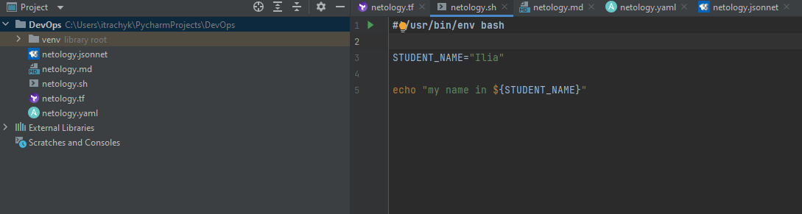
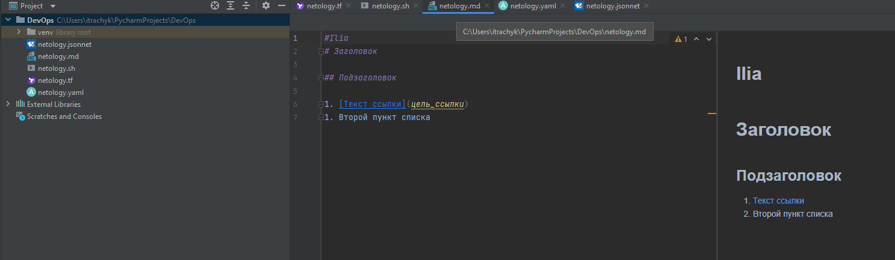

## 1.1. Введение в DevOps - Трачук Илья

## Скриншоты:
- Terraform

- Bash:

- Markdown

- Yaml

- Jsonnet

---

## Задание №2 - Описание жизненного цикла задачи (разработки нового функционала)

Представьте, что вы работаете в стартапе, который запустил интернет-магазин. 
Ваш интернет-магазин достаточно успешно развивался, и вот пришло время налаживать 
процессы: у вас стало больше конечных клиентов, менеджеров и разработчиков.
Сейчас от клиентов вам приходят задачи, связанные с разработкой нового функционала.
Задач много, и все они требуют выкладки на тестовые среды, 
одобрения тестировщика, проверки менеджером перед показом клиенту. 
В случае необходимости, вам будет необходим откат изменений. 

## Решение задачи

### DevOps - инженер:
1) Развернуть среду контроля версий
2) Разработать пайплайн непрерывного развертывание образов
3) Настроить пайплайн таким образом что бы были четкие разграничения вееток проекта (dev, release, prod)
4) Стенды release и prod должны быть максимально идентичны
5) Интегрировать автотесты в пайплайны
6) Развернуть систему логирования и сбора метрик
7) Настроить аллерты

### CI процесс разработки и тестирования:
1) Разработчик пушит изменения в ветку dev
2) В среде контроля версии инициируется сборка проекта
3) Во время/После сборки проект покрывается автотестами
4) После успешного прохождения тестов проект деплоиться на dev стенд
5) После успешного прохждения дополнительных тестов(если присутствуют) Разработчик делает мёрдж-реквест в ветку release
6) Код ветки dev проходит код-ревью
7) Ответсвенное лицо раздрешает мердж 
8) Проект деплоится в release ветку где покрывается дополнительными тестами
9) Производится максимальное комплексное тестирование 
10) Тестироващик составляет баг-репорт
11) Принимается решение о выходе продукта в промышленную эксплуатацию.
