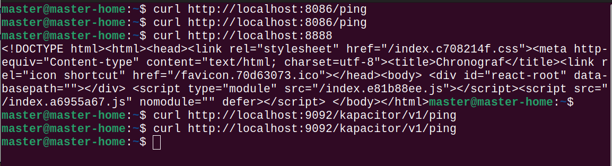
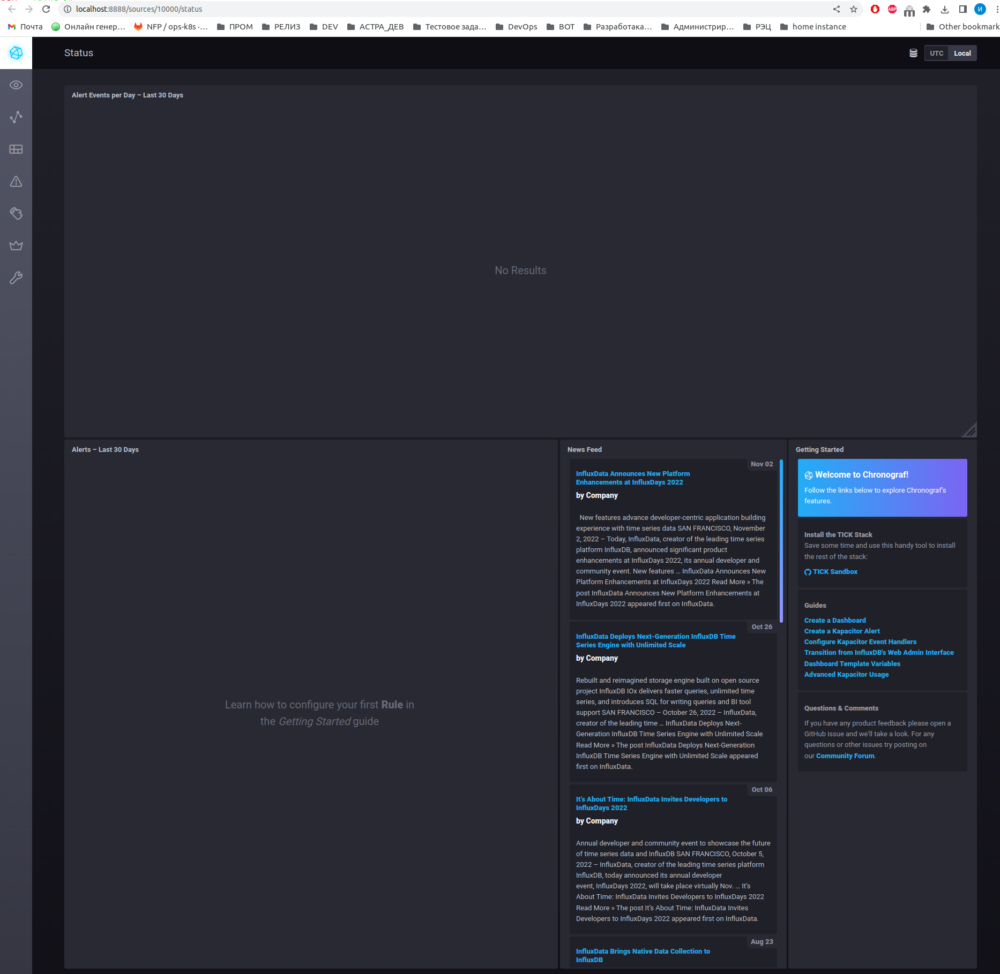
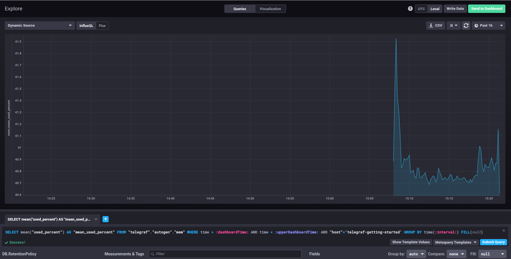
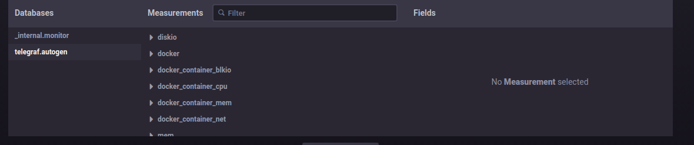

# Домашнее задание к занятию "10.02. Системы мониторинга"

## Обязательные задания

1. Опишите основные плюсы и минусы pull и push систем мониторинга.

- PUSH - удобна для использования в динамически создаваемых машинах (например из докер-контейнеров),
так как в противном случае Система мониторинга должна будет узнавать о новых хостах для их опроса,
можно задавать глубину мониторинга именно на машинах, добавление новых иснтансов автоматом добавит метрику без настройки системы мониторинга
Передача данных в открытом виде по сети, при наличии ПД в метриках есть риск утечки данных
так же есть риск потери данных при недоступности системы мониторинга (принимающей метрики)
передаваться данные должны на один ресурс для сбора (одну систему мониторинга) одним источником
- PULL - контроль над метриками с единой точки, возможность конеккта по SSL к агентам.
более высокий уровень контроля за источниками метрик ,т.е. всегда известно кто откуда что передает,
возможность ставить в Downtime (отключение алертинга) целых систем без потери передаваемых данных (хотя думаю в Push так же реализуемо)
Ну и то что разными системами мониторинга можно получать одни и теже метрики, можно выподнять запросы метрики с изменяемой переодичностью
так же запрашивать метрики в ручном режиме в обход систем сбора
минус - неудобство для динамических машин (докер-контейнеры) нужно динамически собирать статистику о наличии машин, нужен дополнительный оркестратор

2. Какие из ниже перечисленных систем относятся к push модели, а какие к pull? А может есть гибридные?

    - Prometheus - Гибридная : одновременно опрашивает системы, так же может получать данные от агентов exporter-ов, и получать метрики о событиях
    - TICK - 	PUSH : telegraph передает информацию в систему хранилище, так же данные получает Kapasitor по Pull модели
    - Zabbix - 	PULL : использует подключение к ресурсом по стандартным протоколам или же оправшивает сови агенты у становленные на серверах для получения данных
    - VictoriaMetrics - БОльше подходит PUSH, так как метрики записываются в нее, но это (если правильно понял по описанию) система для хранения по большей части, и получает данные, которые к нейпишут другие системы
    - Nagios - PULL : Так же использует опрос snmp, агентов, которые собирают информацию

3. Склонируйте себе [репозиторий](https://github.com/influxdata/sandbox/tree/master) и запустите TICK-стэк,
   используя технологии docker и docker-compose.(по инструкции ./sandbox up )

В виде решения на это упражнение приведите выводы команд с вашего компьютера (виртуальной машины):

    - curl http://localhost:8086/ping
    - curl http://localhost:8888
    - curl http://localhost:9092/kapacitor/v1/ping



А также скриншот веб-интерфейса ПО chronograf (`http://localhost:8888`).



P.S.: если при запуске некоторые контейнеры будут падать с ошибкой - проставьте им режим `Z`, например
`./data:/var/lib:Z`

4. Изучите список [telegraf inputs](https://github.com/influxdata/telegraf/tree/master/plugins/inputs).
    - Добавьте в конфигурацию telegraf плагин - [disk](https://github.com/influxdata/telegraf/tree/master/plugins/inputs/disk):
    ```
    [[inputs.disk]]
      ignore_fs = ["tmpfs", "devtmpfs", "devfs", "iso9660", "overlay", "aufs", "squashfs"]
    ```
    - Так же добавьте в конфигурацию telegraf плагин - [mem](https://github.com/influxdata/telegraf/tree/master/plugins/inputs/mem):
    ```
    [[inputs.mem]]
    ```
    - После настройки перезапустите telegraf.

    - Перейдите в веб-интерфейс Chronograf (`http://localhost:8888`) и откройте вкладку `Data explorer`.
    - Нажмите на кнопку `Add a query`
    - Изучите вывод интерфейса и выберите БД `telegraf.autogen`
    - В `measurments` выберите mem->host->telegraf_container_id , а в `fields` выберите used_percent.
      Внизу появится график утилизации оперативной памяти в контейнере telegraf.
    - Вверху вы можете увидеть запрос, аналогичный SQL-синтаксису.
      Поэкспериментируйте с запросом, попробуйте изменить группировку и интервал наблюдений.
    - Приведите скриншот с отображением
      метрик утилизации места на диске (disk->host->telegraf_container_id) из веб-интерфейса.



5. Добавьте в конфигурацию telegraf следующий плагин - [docker](https://github.com/influxdata/telegraf/tree/master/plugins/inputs/docker):
```
[[inputs.docker]]
  endpoint = "unix:///var/run/docker.sock"
```

Дополнительно вам может потребоваться донастройка контейнера telegraf в `docker-compose.yml` дополнительного volume и
режима privileged:
```
  telegraf:
    image: telegraf:1.4.0
    privileged: true
    volumes:
      - ./etc/telegraf.conf:/etc/telegraf/telegraf.conf:Z
      - /var/run/docker.sock:/var/run/docker.sock:Z
    links:
      - influxdb
    ports:
      - "8092:8092/udp"
      - "8094:8094"
      - "8125:8125/udp"
```

После настройки перезапустите telegraf, обновите веб интерфейс и приведите скриншотом список `measurments` в
веб-интерфейсе базы telegraf.autogen . Там должны появиться метрики, связанные с docker.



Факультативно можете изучить какие метрики собирает telegraf после выполнения данного задания.

## Дополнительное задание (со звездочкой*) - необязательно к выполнению

В веб-интерфейсе откройте вкладку `Dashboards`. Попробуйте создать свой dashboard с отображением:

    - утилизации ЦПУ
    - количества использованного RAM
    - утилизации пространства на дисках
    - количество поднятых контейнеров
    - аптайм
    - ...
    - фантазируйте)
    
    ---

### Как оформить ДЗ?

Выполненное домашнее задание пришлите ссылкой на .md-файл в вашем репозитории.

---

