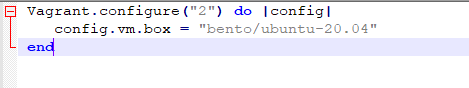

# Домашнее задание к занятию "3.1. Работа в терминале, лекция 1"

1. Установите средство виртуализации [Oracle VirtualBox](https://www.virtualbox.org/).


1. Установите средство автоматизации [Hashicorp Vagrant](https://www.vagrantup.com/).

1. С помощью базового файла конфигурации запустите Ubuntu 20.04 в VirtualBox посредством Vagrant:

	* Создайте директорию, в которой будут храниться конфигурационные файлы Vagrant. В ней выполните `vagrant init`. Замените содержимое Vagrantfile по умолчанию следующим:

		```bash
		Vagrant.configure("2") do |config|
			config.vm.box = "bento/ubuntu-20.04"
		end
		```

	
	* Выполнение в этой директории `vagrant up` установит провайдер VirtualBox для Vagrant, скачает необходимый образ и запустит виртуальную машину.

	* `vagrant suspend` выключит виртуальную машину с сохранением ее состояния (т.е., при следующем `vagrant up` будут запущены все процессы внутри, которые работали на момент вызова suspend), `vagrant halt` выключит виртуальную машину штатным образом.

1. Ознакомьтесь с графическим интерфейсом VirtualBox, посмотрите как выглядит виртуальная машина, которую создал для вас Vagrant, какие аппаратные ресурсы ей выделены. Какие ресурсы выделены по-умолчанию?

2. Ознакомьтесь с возможностями конфигурации VirtualBox через Vagrantfile: [документация](https://www.vagrantup.com/docs/providers/virtualbox/configuration.html). Как добавить оперативной памяти или ресурсов процессора виртуальной машине?

3. Команда `vagrant ssh` из директории, в которой содержится Vagrantfile, позволит вам оказаться внутри виртуальной машины без каких-либо дополнительных настроек. Попрактикуйтесь в выполнении обсуждаемых команд в терминале Ubuntu.

4. Ознакомиться с разделами `man bash`, почитать о настройках самого bash:
    * какой переменной можно задать длину журнала `history`, и на какой строчке manual это описывается?
   
   Параметр history [n] на 3601 строке man bash
    * что делает директива `ignoreboth` в bash?
   
   ignoreboth - это объединение ignorespace и ignoredups. ignorespace не сохранияет команды начинающиеся с символа "пробел" а ignoredups не сохраняет строки которые совподают с последней выполненной комане
5. В каких сценариях использования применимы скобки `{}` и на какой строчке `man bash` это описано?
Строки 117, 123, 954

Для env (${HOST_IP})

Для списков ({A...Z})

Для циклов (touch file_{A...Z})

6. С учётом ответа на предыдущий вопрос, как создать однократным вызовом `touch` 100000 файлов? Получится ли аналогичным образом создать 300000? Если нет, то почему?
Что бы создать 100000 нужно выполнить коману - touch {000001..100000}.yml

Создать 300000 не получится. Выйдет ошибка -bash: /usr/bin/touch: Argument list too long

7. В man bash поищите по `/\[\[`. Что делает конструкция `[[ -d /tmp ]]`

-d /tmp Проверяет наличие директории /tmp
8. Основываясь на знаниях о просмотре текущих (например, PATH) и установке новых переменных; командах, которые мы рассматривали, добейтесь в выводе type -a bash в виртуальной машине наличия первым пунктом в списке:

    ```bash
    bash is /tmp/new_path_directory/bash
    bash is /usr/local/bin/bash
    bash is /bin/bash

mkdir /tmp/new_path_directory/

cp /bin/bash /tmp/new_path_directory/

PATH=/tmp/new_path_directory/:$PATH

type -a bash


9. Чем отличается планирование команд с помощью `batch` и `at`?
Судя из вывода команды man batch, batch запускается когда нагрузка на систему падает ниже 1,5%
A at запускается по расписанию

10. Завершите работу виртуальной машины чтобы не расходовать ресурсы компьютера и/или батарею ноутбука.

sudo poweroff
 
