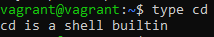
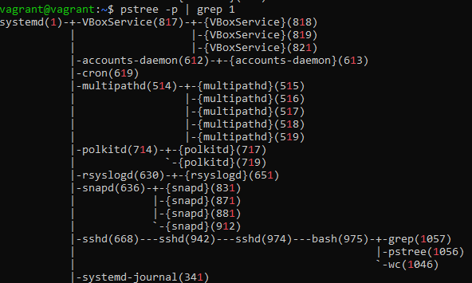
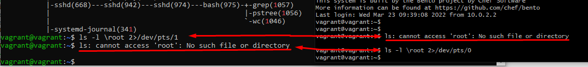
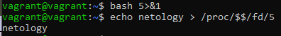
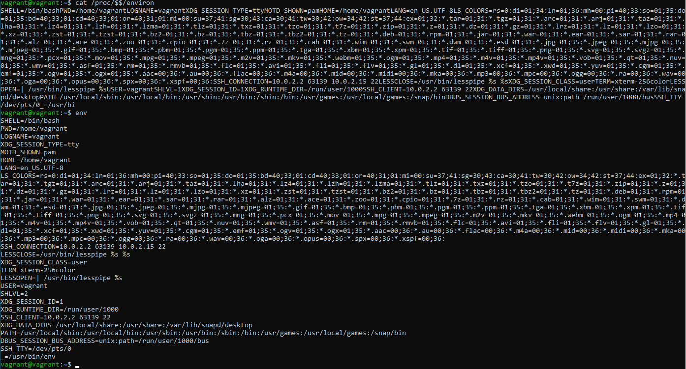
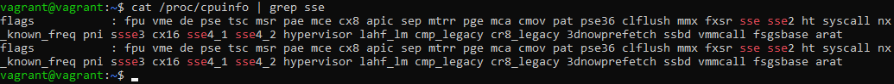
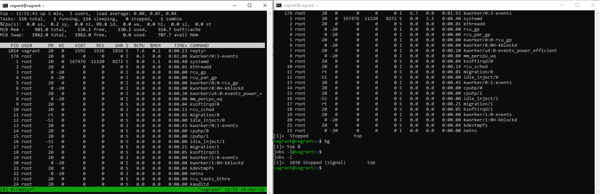

# Домашнее задание к занятию "3.2. Работа в терминале, лекция 2"

1. Какого типа команда `cd`? Попробуйте объяснить, почему она именно такого типа; опишите ход своих мыслей, если считаете что она могла бы быть другого типа.

Команда cd изменяет текущий рабочий каталог. Команда cd не может быть отдельным процессом потому что ему бы пришлось изменять свой рабочий каталог. что не возможно в Unix

3. Какая альтернатива без pipe команде `grep <some_string> <some_file> | wc -l`? `man grep` поможет в ответе на этот вопрос. Ознакомьтесь с [документом](http://www.smallo.ruhr.de/award.html) о других подобных некорректных вариантах использования pipe.

grep <some_string> <some_file> -c

4. Какой процесс с PID `1` является родителем для всех процессов в вашей виртуальной машине Ubuntu 20.04?

Ответ - systemd

5. Как будет выглядеть команда, которая перенаправит вывод stderr `ls` на другую сессию терминала?

ls -l \root 2>/dev/pts/[n]

6. Получится ли одновременно передать команде файл на stdin и вывести ее stdout в другой файл? Приведите работающий пример.

envsubst '${HOST_IP}' < /etc/kibana/kibana_env.txt > /etc/kibana/kibana.yml

7. Получится ли находясь в графическом режиме, вывести данные из PTY в какой-либо из эмуляторов TTY? Сможете ли вы наблюдать выводимые данные?

Да, получится. Нужно выполнить перенаправление вывода в соответствующий TTY. .... > dev/tty(3..6)

8. Выполните команду `bash 5>&1`. К чему она приведет? Что будет, если вы выполните `echo netology > /proc/$$/fd/5`? Почему так происходит?

Первой командой мы создали новый дескриптор и перенаправили его в stdout

Второй командой мы записали в созданный дескриптор "netology"

Дескриптор &1 выведет результат записанный в &5

9. Получится ли в качестве входного потока для pipe использовать только stderr команды, не потеряв при этом отображение stdout на pty? Напоминаем: по умолчанию через pipe передается только stdout команды слева от `|` на stdin команды справа.

Получится. Для этого надо объединить выводы stdin и out в один дескриптор.

ls -l /test 6>&2 2>&1 1>&6 | grep /

10. Что выведет команда `cat /proc/$$/environ`? Как еще можно получить аналогичный по содержанию вывод?

Команда cat /proc/$$/environ выведет переменные среды.
Аналогичная команда - команда env

11. Используя `man`, опишите что доступно по адресам `/proc/<PID>/cmdline`, `/proc/<PID>/exe`.

man proc 
/proc/<PID>/cmdline - строка 160
Этот доступный только для чтения файл содержит полную командную строку для процесса, если этот процесс не является зомби. В последнем случае ничего ing в этом файле: то есть чтение этого файла вернет 0 символов. Аргументы командной строки отображаются в этом файле как набор строки, разделенные нулевыми байтами ('\0'), с дополнительным нулевым байтом после последней строки.

/proc/<PID>/exe - строка 207
В Linux 2.2 и более поздних версиях этот файл представляет собой символическую ссылку, содержащую фактический путь к выполняемой команде.

12. Узнайте, какую наиболее старшую версию набора инструкций SSE поддерживает ваш процессор с помощью `/proc/cpuinfo`.

Ответ - SSE 4_2

13. При открытии нового окна терминала и `vagrant ssh` создается новая сессия и выделяется pty. Это можно подтвердить командой `tty`, которая упоминалась в лекции 3.2. Однако:

Скорее всего потому что tty это не ssh соединение. И он не принимает ssh

14. Бывает, что есть необходимость переместить запущенный процесс из одной сессии в другую. Попробуйте сделать это, воспользовавшись `reptyr`. Например, так можно перенести в `screen` процесс, который вы запустили по ошибке в обычной SSH-сессии.

top  
CTRL+Z  
bg 
jobs -l  
Вывод команды "jobs -l" говорит нам что PID процесса top - 1038  
Теперь открываем новый терминал и вводим команду tmux  
Вводим команду reptyr 1038. Видим результат как на картинке
P.S.  
Может ругаться на kernel 10-strace.conf. Для исправления ошибки нужно отредактировать файл и заменить единственный открытый параметр с 1 на 0. После чего перезагрузить машину.

15. `sudo echo string > /root/new_file` не даст выполнить перенаправление под обычным пользователем, так как перенаправлением занимается процесс shell'а, который запущен без `sudo` под вашим пользователем. Для решения данной проблемы можно использовать конструкцию `echo string | sudo tee /root/new_file`. Узнайте что делает команда `tee` и почему в отличие от `sudo echo` команда с `sudo tee` будет работать.

В команде sudo echo string > /root/new_file под правами sudo только команда echo. Прав на запись файла нет.
В команде echo string | sudo tee /root/new_file сначала идет вывод из echo затем tee считывает out и пишет в файл
