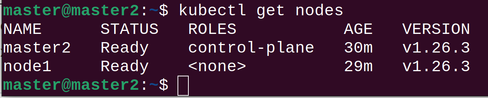
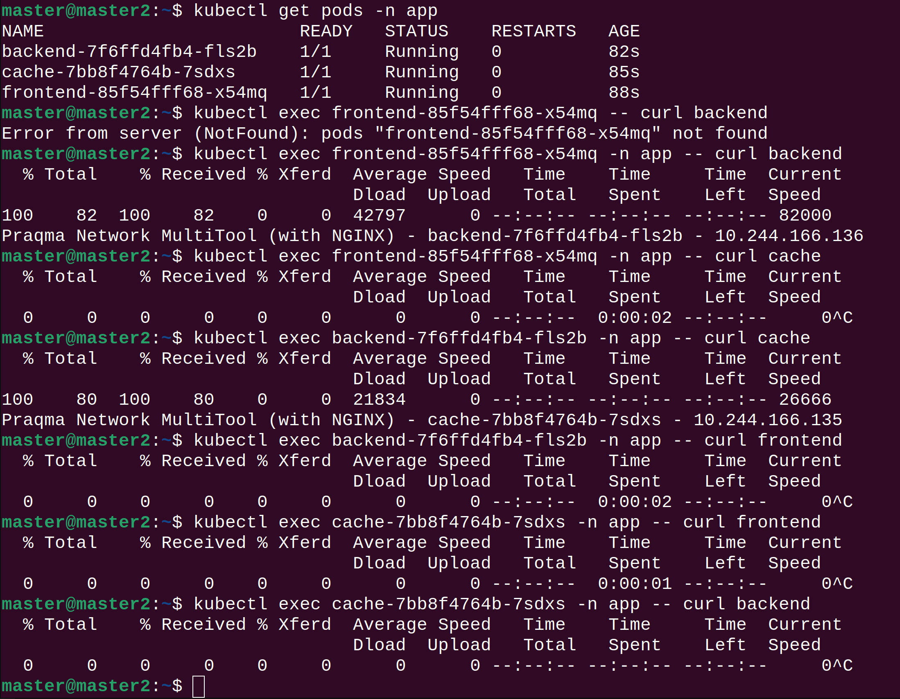

# Домашнее задание к занятию "Как работает сеть в K8S"

### Цель задания

Настроить сетевую политику доступа к подам.

### Чеклист готовности к домашнему заданию

1. Кластер k8s с установленным сетевым плагином calico

### Инструменты и дополнительные материалы, которые пригодятся для выполнения задания

1. [Документация Calico](https://www.tigera.io/project-calico/)
2. [Network Policy](https://kubernetes.io/docs/concepts/services-networking/network-policies/)
3. [About Network Policy](https://docs.projectcalico.org/about/about-network-policy)

-----

### Задание 1. Создать сетевую политику (или несколько политик) для обеспечения доступа

1. Создать deployment'ы приложений frontend, backend и cache и соответсвующие сервисы.
2. В качестве образа использовать network-multitool.
3. Разместить поды в namespace app.
4. Создать политики чтобы обеспечить доступ frontend -> backend -> cache. Другие виды подключений должны быть запрещены.
5. Продемонстрировать, что трафик разрешен и запрещен.

**Файлы манифестов Домашнее задание к занятию 3.3 "Как работает сеть в K8S"/manifests**

[main](manifests%2Fmain)

[10-frontend.yaml](manifests%2Fmain%2F10-frontend.yaml)

[20-backend.yaml](manifests%2Fmain%2F20-backend.yaml)

[30-cache.yaml](manifests%2Fmain%2F30-cache.yaml)

[network-policy](manifests%2Fnetwork-policy)

[00-default.yaml](manifests%2Fnetwork-policy%2F00-default.yaml)

[10-frontend.yaml](manifests%2Fnetwork-policy%2F10-frontend.yaml)

[20-backend.yaml](manifests%2Fnetwork-policy%2F20-backend.yaml)

[30-cache.yaml](manifests%2Fnetwork-policy%2F30-cache.yaml)

### Правила приема работы

1. Домашняя работа оформляется в своем Git репозитории в файле README.md. Выполненное домашнее задание пришлите ссылкой на .md-файл в вашем репозитории.
2. Файл README.md должен содержать скриншоты вывода необходимых команд, а также скриншоты результатов
3. Репозиторий должен содержать тексты манифестов или ссылки на них в файле README.md