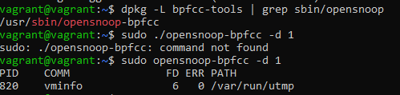

1. Какой системный вызов делает команда `cd`? В прошлом ДЗ мы выяснили, что `cd` не является самостоятельной  программой, это `shell builtin`, поэтому запустить `strace` непосредственно на `cd` не получится. Тем не менее, вы можете запустить `strace` на `/bin/bash -c 'cd /tmp'`. В этом случае вы увидите полный список системных вызовов, которые делает сам `bash` при старте. Вам нужно найти тот единственный, который относится именно к `cd`. Обратите внимание, что `strace` выдаёт результат своей работы в поток stderr, а не в stdout.


3. Попробуйте использовать команду `file` на объекты разных типов на файловой системе. Например:
    ```bash
    vagrant@netology1:~$ file /dev/tty
    /dev/tty: character special (5/0)
    vagrant@netology1:~$ file /dev/sda
    /dev/sda: block special (8/0)
    vagrant@netology1:~$ file /bin/bash
    /bin/bash: ELF 64-bit LSB shared object, x86-64
    ```
    Используя `strace` выясните, где находится база данных `file` на основании которой она делает свои догадки.

База данных находится в директории: /usr/share/misc/magic.mgc

4. Предположим, приложение пишет лог в текстовый файл. Этот файл оказался удален (deleted в lsof), однако возможности сигналом сказать приложению переоткрыть файлы или просто перезапустить приложение – нет. Так как приложение продолжает писать в удаленный файл, место на диске постепенно заканчивается. Основываясь на знаниях о перенаправлении потоков предложите способ обнуления открытого удаленного файла (чтобы освободить место на файловой системе).

Мы создали процесс ping, перенаправили его в файл и празу удалили. Процесс остался с PID 1340.

sudo truncate -s 0 /proc/1340/fd/1 обнулит файл а kill -9 1340 удалит сам процесс 


5. Занимают ли зомби-процессы какие-то ресурсы в ОС (CPU, RAM, IO)?

Зомби процесс — дочерний процесс в Unix-системе, завершивший своё выполнение.
Следуя из того что процесс завершенный он не занимает место в памяти. Он существует до того момента пока родительский процесс не считает его код завершения.
Однако этот процесс будет занимать дисковое пространство. А так же при достижении лимита процессов может быть не возможен например вход в систему.

6. В iovisor BCC есть утилита `opensnoop`:
    ```bash
    root@vagrant:~# dpkg -L bpfcc-tools | grep sbin/opensnoop
    /usr/sbin/opensnoop-bpfcc
    ```
    На какие файлы вы увидели вызовы группы `open` за первую секунду работы утилиты? Воспользуйтесь пакетом `bpfcc-tools` для Ubuntu 20.04. Дополнительные [сведения по установке](https://github.com/iovisor/bcc/blob/master/INSTALL.md).



7. Какой системный вызов использует `uname -a`? Приведите цитату из man по этому системному вызову, где описывается альтернативное местоположение в `/proc`, где можно узнать версию ядра и релиз ОС.

uname -a - Используется системный вызов uname - получает название ядра и информацию о нем. 
Part of the utsname information is also accessible via /proc/sys/kernel/{ostype, hostname, osrelease, version, domainname}.

8. Чем отличается последовательность команд через `;` и через `&&` в bash? Например:
    ```bash
    root@netology1:~# test -d /tmp/some_dir; echo Hi
    Hi
    root@netology1:~# test -d /tmp/some_dir && echo Hi
    root@netology1:~#
    ```
    Есть ли смысл использовать в bash `&&`, если применить `set -e`?

; - последовательное выполнение команд после окончания предыдущей 
&& - последовательное выполнение команд при условии что предыдущая команда выпонилась успешно

set -e выполняет немедленный выход при выполнении команды с нулевым результатом
&& не выйдет при выполнении команды если будет нулевыой результат а продолжит выполснение следующей команды. В определенных скриптах, полагаю, это может пригодиться.

9. Из каких опций состоит режим bash `set -euxo pipefail` и почему его хорошо было бы использовать в сценариях?

-e скрипт немедленно завершит работу, если любая команда выйдет с ошибкой.
-u Если переменной в скрипте не будет, скрипт немедленно завершиться.  
-x вывод всех команд перед выполнением.
-o pipefail: - это значение последней команды для выхода с ненулевым статусом или ноль, если все команды в конвейере завершаются успешно.

10. Используя `-o stat` для `ps`, определите, какой наиболее часто встречающийся статус у процессов в системе. В `man ps` ознакомьтесь (`/PROCESS STATE CODES`) что значат дополнительные к основной заглавной буквы статуса процессов. Его можно не учитывать при расчете (считать S, Ss или Ssl равнозначными).

T - stopped by job control signal
