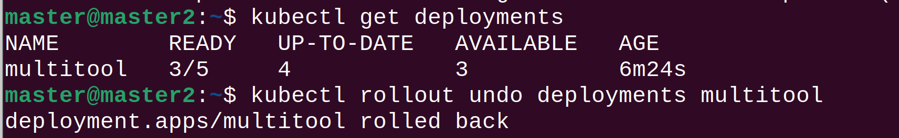

# Домашнее задание к занятию "Обновление приложений"

### Цель задания
Выбрать и настроить стратегию обновления приложения.

### Чеклист готовности к домашнему заданию

1. Кластер k8s.

### Инструменты и дополнительные материалы, которые пригодятся для выполнения задания

1. [Документация Updating a Deployment](https://kubernetes.io/docs/concepts/workloads/controllers/deployment/#updating-a-deployment)
2. [Статья про стратегии обновлений](https://habr.com/ru/companies/flant/articles/471620/)

-----

### Задание 1. Выбрать стратегию обновления приложения и описать ваш выбор.

1. Имеется приложение, состоящее из нескольких реплик, которое требуется обновить.
2. Ресурсы, выделенные для приложения ограничены, и нет возможности их увеличить.
3. Запас по ресурсам в менее загруженный момент времени составляет 20%.
4. Обновление мажорное, новые версии приложения не умеют работать со старыми.
5. Какую стратегию обновления выберете и почему?

Ответ:

Лучшим вариантом будет использование Rolling Update так как он постепенно обновляет поды. Тем самым мы сохраняем доступность 
сервиса. Так как у нас есть запас в менее загруженный момент составляющий 20% то предлагаю:
- maxSurge: 20%
- maxUnavailable: 20%

### Задание 2. Обновить приложение.

1. Создать deployment приложения с контейнерами nginx и multitool. Версию nginx взять 1.19. Кол-во реплик - 5.
2. Обновить версию nginx в приложении до версии 1.20, сократив время обновления до минимума. Приложение должно быть доступно.
3. Попытаться обновить nginx до версии 1.28, приложение должно оставаться доступным.
4. Откатиться после неудачного обновления.

Ответ.
1. Для создания деплоймента использовал манифест [create_deployment.yaml](manifests%2Fcreate_deployment.yaml)


``kubectl apply -f 1.yaml  ``


2. Для обновления деплоймента использовал манифест [update_deployment.yaml](manifests%2Fupdate_deployment.yaml)


3. Для обновления с ошибкой использовал манифест [update_error_deployment.yaml](manifests%2Fupdate_error_deployment.yaml)


4. Для отката ошибки использовал команду ```kubectl rollout undo deployments multitool```




## Дополнительные задания (со звездочкой*)

**Настоятельно рекомендуем выполнять все задания под звёздочкой.**   Их выполнение поможет глубже разобраться в материале.   
Задания под звёздочкой дополнительные (необязательные к выполнению) и никак не повлияют на получение вами зачета по этому домашнему заданию.

### Задание 3*. Создать Canary deployment.

1. Создать 2 deployment'а приложения nginx.
2. При помощи разных ConfigMap сделать 2 версии приложения (веб-страницы).
3. С помощью ingress создать канареечный деплоймент, чтобы можно было часть трафика перебросить на разные версии приложения.

### Правила приема работы

1. Домашняя работа оформляется в своем Git репозитории в файле README.md. Выполненное домашнее задание пришлите ссылкой на .md-файл в вашем репозитории.
2. Файл README.md должен содержать скриншоты вывода необходимых команд, а также скриншоты результатов
3. Репозиторий должен содержать тексты манифестов или ссылки на них в файле README.md