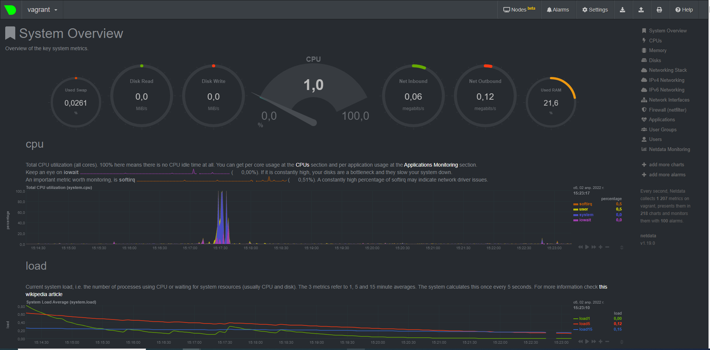

# Домашнее задание к занятию "3.4. Операционные системы, лекция 2"

1. На лекции мы познакомились с [node_exporter](https://github.com/prometheus/node_exporter/releases). В демонстрации его исполняемый файл запускался в background. Этого достаточно для демо, но не для настоящей production-системы, где процессы должны находиться под внешним управлением. Используя знания из лекции по systemd, создайте самостоятельно простой [unit-файл](https://www.freedesktop.org/software/systemd/man/systemd.service.html) для node_exporter:

В systemd запуск сервиса выглядит так:

[Unit]
Description=Node Exporter

[Service]
User=root
EnvironmentFile=-/etc/sysconfig/node_exporter
ExecStart=/usr/local/bin/node_exporter $OPTIONS

[Install]
WantedBy=multi-user.target[Unit]
Description=Node Exporter

1. Ознакомьтесь с опциями node_exporter и выводом `/metrics` по-умолчанию. Приведите несколько опций, которые вы бы выбрали для базового мониторинга хоста по CPU, памяти, диску и сети.

node_cpu_seconds_total{cpu="0",mode="system"} 20.13
node_cpu_seconds_total{cpu="0",mode="user"} 10.58

node_memory_MemTotal_bytes
node_memory_MemFree_bytes

node_disk_read_time_seconds_total{device="sda"}
node_disk_write_time_seconds_total{device="sda"}

node_network_speed_bytes{device="eth0"}
node_network_up{device="eth0"}

2. Установите в свою виртуальную машину [Netdata](https://github.com/netdata/netdata). Воспользуйтесь [готовыми пакетами](https://packagecloud.io/netdata/netdata/install) для установки (`sudo apt install -y netdata`). После успешной установки:

3. Можно ли по выводу `dmesg` понять, осознает ли ОС, что загружена не на настоящем оборудовании, а на системе виртуализации?

Да, можно

4. Как настроен sysctl `fs.nr_open` на системе по-умолчанию? Узнайте, что означает этот параметр. Какой другой существующий лимит не позволит достичь такого числа (`ulimit --help`)?

Судя по мануалу - это значение максимально возможных открытых дескрипторов

!

5. Запустите любой долгоживущий процесс (не `ls`, который отработает мгновенно, а, например, `sleep 1h`) в отдельном неймспейсе процессов; покажите, что ваш процесс работает под PID 1 через `nsenter`. Для простоты работайте в данном задании под root (`sudo -i`). Под обычным пользователем требуются дополнительные опции (`--map-root-user`) и т.д.

6. Найдите информацию о том, что такое `:(){ :|:& };:`. Запустите эту команду в своей виртуальной машине Vagrant с Ubuntu 20.04 (**это важно, поведение в других ОС не проверялось**). Некоторое время все будет "плохо", после чего (минуты) – ОС должна стабилизироваться. Вызов `dmesg` расскажет, какой механизм помог автоматической стабилизации. Как настроен этот механизм по-умолчанию, и как изменить число процессов, которое можно создать в сессии?

Команда :(){ :|:& };: запускает себя снова и снова пропуская через себя вывод. Получается бесконечный цикл который нагружает процесор. Эту команду ещё называют Bash Bomb

Запустился bpfilter

Что бы ограничить количество процессов модно ввести команду ulimit -u 50. Число процессов для пользователя будет ограничено 50.

