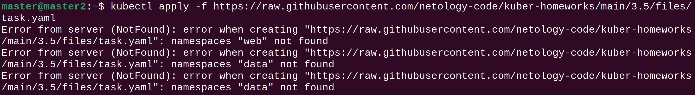
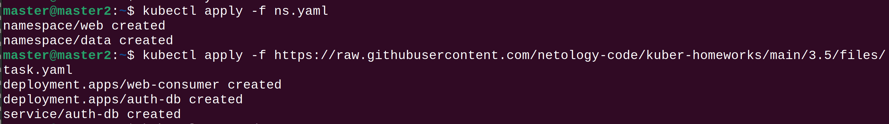
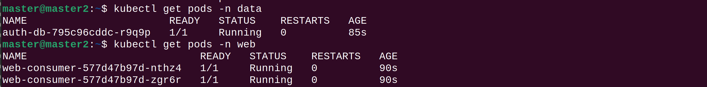
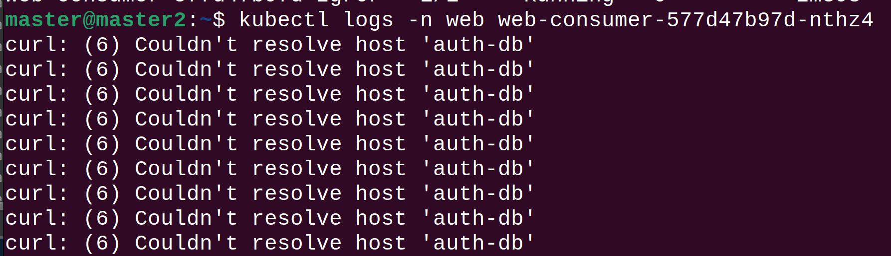
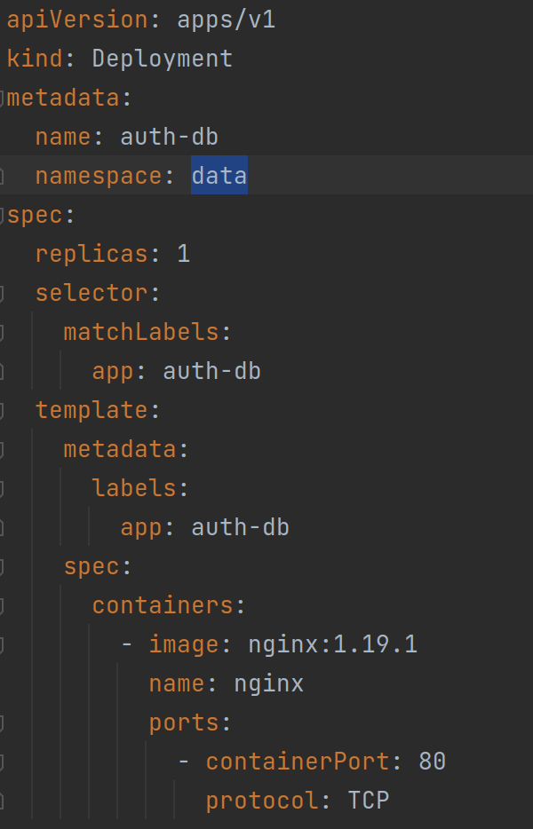
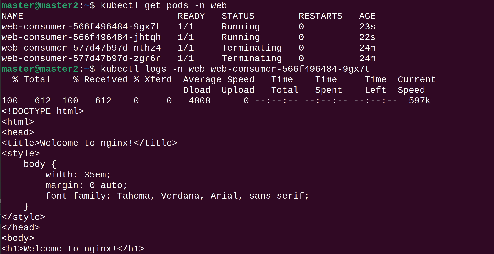

# Домашнее задание к занятию "Troubleshooting"

### Цель задания

Устранить неисправности при деплое приложения.

### Чеклист готовности к домашнему заданию

1. Кластер k8s.



### Задание. При деплое приложение web-consumer не может подключиться к auth-db. Необходимо это исправить.

1. Установить приложение по команде:
```shell
kubectl apply -f https://raw.githubusercontent.com/netology-code/kuber-homeworks/main/3.5/files/task.yaml
```
2. Выявить проблему и описать.
3. Исправить проблему, описать, что сделано.
4. Продемонстрировать, что проблема решена.

Ответ.


При попыткe установить манифест выскакивают ошибки с неймспейсами. Их необходимо создать [ns.yaml](manifests%2Fns.yaml)



После ошибки деплойменты создались.

Поды запустились успешно.



Следующая проблема заключается в том что веб не может достучаться до auth-db



Из манифеста создания видно что auth-db сервис находится в другом неймспейсе а web-consumer в неймспейсе web.



При осмотре манифеста для web-consumer видим команду ```while true; do curl auth-db; sleep 5; done``` Следовательно сервис web-consumer
обращается к auth-db в рамках своего неймспейса. Требуется корректировака запроса curl. Для взаимодействия между сервисами в разных неймспейсах требуется явно указать неймспейс для обращения. В нашем случае auth-db.data
Отредактированный yaml [task.yaml](manifests%2Ftask.yaml)




### Правила приема работы

1. Домашняя работа оформляется в своем Git репозитории в файле README.md. Выполненное домашнее задание пришлите ссылкой на .md-файл в вашем репозитории.
2. Файл README.md должен содержать скриншоты вывода необходимых команд, а также скриншоты результатов
3. Репозиторий должен содержать тексты манифестов или ссылки на них в файле README.md