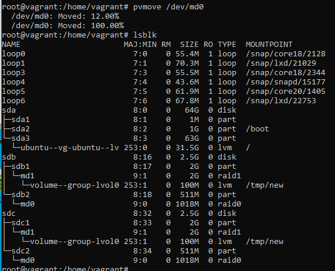

Домашнее задание к занятию "3.5. Файловые системы"

1) Узнайте о sparse (разряженных) файлах.

Преимущества:

- экономия дискового пространства. Использование разрежённых файлов считается одним из способов сжатия данных на уровне файловой системы;
- отсутствие временных затрат на запись нулевых байт;
- увеличение срока службы запоминающих устройств.

Недостатки:

- накладные расходы на работу со списком дыр;
- фрагментация файла при частой записи данных в дыры;
- невозможность записи данных в дыры при отсутствии свободного места на диске;
- невозможность использования других индикаторов дыр, кроме нулевых байт.

2) Могут ли файлы, являющиеся жесткой ссылкой на один объект, иметь разные права доступа и владельца? Почему?

hardlink - это жесткая ссылка на конкретный файл. Это означает что нельзя иметь разные права доступа и владельцев.

3) Сделайте vagrant destroy на имеющийся инстанс Ubuntu. Замените содержимое Vagrantfile следующим:

Созданы диски sdb + sdc

4) Используя fdisk, разбейте первый диск на 2 раздела: 2 Гб, оставшееся пространство.

5) Используя sfdisk, перенесите данную таблицу разделов на второй диск.

6) Соберите mdadm RAID1 на паре разделов 2 Гб.

7) Соберите mdadm RAID0 на второй паре маленьких разделов.

8) Создайте 2 независимых PV на получившихся md-устройствах.

9) Создайте общую volume-group на этих двух PV.

10) Создайте LV размером 100 Мб, указав его расположение на PV с RAID0.

11) Создайте mkfs.ext4 ФС на получившемся LV.

12) Смонтируйте этот раздел в любую директорию, например, /tmp/new.

13) Поместите туда тестовый файл, например wget https://mirror.yandex.ru/ubuntu/ls-lR.gz -O /tmp/new/test.gz.

14) Прикрепите вывод lsblk.

15) Протестируйте целостность файла:

root@vagrant:~# gzip -t /tmp/new/test.gz
root@vagrant:~# echo $?
0

16) Используя pvmove, переместите содержимое PV с RAID0 на RAID1.

17) Сделайте --fail на устройство в вашем RAID1 md.

18) Подтвердите выводом dmesg, что RAID1 работает в деградированном состоянии.

19) Протестируйте целостность файла, несмотря на "сбойный" диск он должен продолжать быть доступен:

root@vagrant:~# gzip -t /tmp/new/test.gz
root@vagrant:~# echo $?
0

20) Погасите тестовый хост, vagrant destroy.

