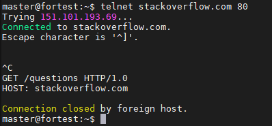
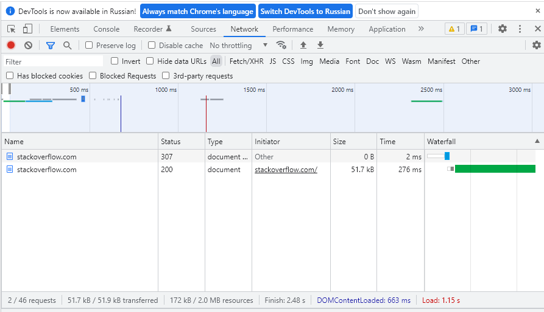
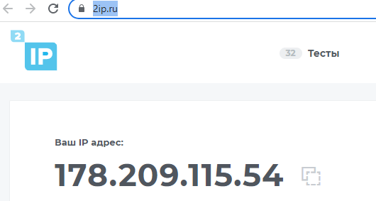
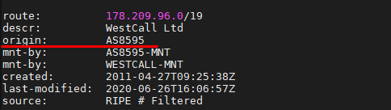
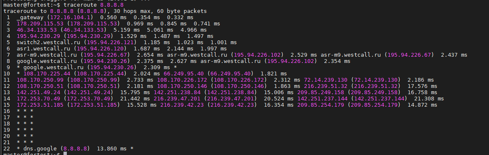
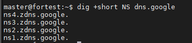
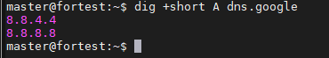
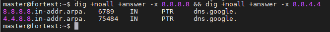

1) Работа c HTTP через телнет.
2) 

2) Повторите задание 1 в браузере, используя консоль разработчика F12.

- откройте вкладку Network
- отправьте запрос http://stackoverflow.com
- найдите первый ответ HTTP сервера, откройте вкладку Headers

- укажите в ответе полученный HTTP код.

Код: 200

- проверьте время загрузки страницы, какой запрос обрабатывался дольше всего?

https://stats.g.doubleclick.net/j/collect?t=dc&aip=1&_r=3&v=1&_v=j96&tid=UA-108242619-1&cid=983812727.1629361591&jid=1336826099&gjid=1197362256&_gid=1123432196.1650270258&_u=SCCACEAAFAAAAC~&z=30401554

3) Какой IP адрес у вас в интернете?

4) Какому провайдеру принадлежит ваш IP адрес? Какой автономной системе AS? Воспользуйтесь утилитой whois

5) Через какие сети проходит пакет, отправленный с вашего компьютера на адрес 8.8.8.8? Через какие AS? Воспользуйтесь утилитой traceroute

6) Повторите задание 5 в утилите mtr. На каком участке наибольшая задержка - delay?

7) Какие DNS сервера отвечают за доменное имя dns.google? Какие A записи? воспользуйтесь утилитой dig

A записи домена:

DNS сервера которые отвечают за доменное имя dns.google - это:

8) Проверьте PTR записи для IP адресов из задания 7. Какое доменное имя привязано к IP? воспользуйтесь утилитой dig

