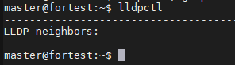
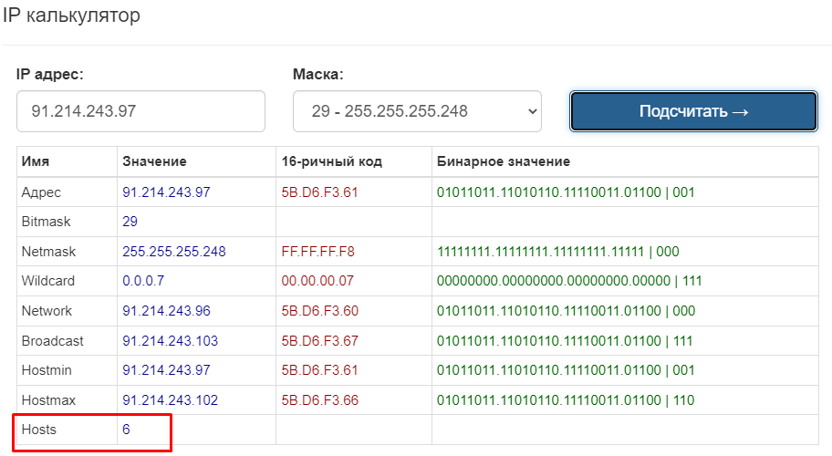

1) Проверьте список доступных сетевых интерфейсов на вашем компьютере. Какие команды есть для этого в Linux и в Windows?
Linux - ifconfig, ip a
Wingows - ipconfig -all

2) Какой протокол используется для распознавания соседа по сетевому интерфейсу? Какой пакет и команды есть в Linux для этого?
Используется lldpd:

3) Какая технология используется для разделения L2 коммутатора на несколько виртуальных сетей? Какой пакет и команды есть в Linux для этого? Приведите пример конфига.
Для разделения сети на виртуальные используется vlan.
Пример настройки:
sudo vconfig add enp0s1 9 #Создаём vlan 9 на интерфейсе enp0s1
4) 
sudo ip addr add 10.0.0.9/24 dev enp0s1.9 #Присваеваем ip для vlan

sudo ip link set up enp0s1.9 #Запускаем виртуальный интерфейс

Пример конфига для Ubuntu:

    network:
      ethernets:
        enp1s0:
          dhcp4: false
          addresses:
            - 192.168.122.201/24
          gateway4: 192.168.122.1
          nameservers:
              addresses: [8.8.8.8, 1.1.1.1]

        vlans:
            enp1s0.100:
                id: 100
                link: enp1s0
                addresses: [192.168.100.2/24]

4) Какие типы агрегации интерфейсов есть в Linux? Какие опции есть для балансировки нагрузки? Приведите пример конфига.

Типы агрегации (объединения) интерфейсов в Linux
mode=0 (balance-rr)
Этот режим используется по-умолчанию, если в настройках не указано другое. balance-rr обеспечивает балансировку нагрузки и отказоустойчивость. В данном режиме пакеты отправляются "по кругу" от первого интерфейса к последнему и сначала. Если выходит из строя один из интерфейсов, пакеты отправляются на остальные оставшиеся.При подключении портов к разным коммутаторам, требует их настройки.

mode=1 (active-backup)
При active-backup один интерфейс работает в активном режиме, остальные в ожидающем. Если активный падает, управление передается одному из ожидающих. Не требует поддержки данной функциональности от коммутатора.

mode=2 (balance-xor)
Передача пакетов распределяется между объединенными интерфейсами по формуле ((MAC-адрес источника) XOR (MAC-адрес получателя)) % число интерфейсов. Один и тот же интерфейс работает с определённым получателем. Режим даёт балансировку нагрузки и отказоустойчивость.

mode=3 (broadcast)
Происходит передача во все объединенные интерфейсы, обеспечивая отказоустойчивость.

mode=4 (802.3ad)
Это динамическое объединение портов. В данном режиме можно получить значительное увеличение пропускной способности как входящего так и исходящего трафика, используя все объединенные интерфейсы. Требует поддержки режима от коммутатора, а так же (иногда) дополнительную настройку коммутатора.

mode=5 (balance-tlb)
Адаптивная балансировка нагрузки. При balance-tlb входящий трафик получается только активным интерфейсом, исходящий - распределяется в зависимости от текущей загрузки каждого интерфейса. Обеспечивается отказоустойчивость и распределение нагрузки исходящего трафика. Не требует специальной поддержки коммутатора.

mode=6 (balance-alb)
Адаптивная балансировка нагрузки (более совершенная). Обеспечивает балансировку нагрузки как исходящего (TLB, transmit load balancing), так и входящего трафика (для IPv4 через ARP). Не требует специальной поддержки коммутатором, но требует возможности изменять MAC-адрес устройства.

Пример объединения интерфейсов в bond:

    bonds:
        bond0:
          dhcp4: no
          interfaces: [enp0s3, enp0s4]
          parameters: 
            mode: 802.3ad
            mii-monitor-interval: 1

5) Сколько IP адресов в сети с маской /29 ? Сколько /29 подсетей можно получить из сети с маской /24. Приведите несколько примеров /29 подсетей внутри сети 10.10.10.0/24.

В 24 подсети 256 адресов. Делим 256/8 (8- все адреса в 29 маске) и получаем 32 - это число возможных подсетей с 29 маской

10.10.10.0/29

10.10.10.8/29

10.10.10.16/29

.....

6) Задача: вас попросили организовать стык между 2-мя организациями. Диапазоны 10.0.0.0/8, 172.16.0.0/12, 192.168.0.0/16 уже заняты. Из какой подсети допустимо взять частные IP адреса? Маску выберите из расчета максимум 40-50 хостов внутри подсети.

Выбираем свежую в комьюнити сеть 100.64.0.0 — 100.127.255.255 с маской 255.192.0.0 (/10)

7) Как проверить ARP таблицу в Linux, Windows? Как очистить ARP кеш полностью? Как из ARP таблицы удалить только один нужный IP?

Windows это команда arp -a

Linux есть утилита arp входящая в пакет net-tools

Удалить конкретный ip можно добавив флаг -d:

arp -d 192.168.0.110

