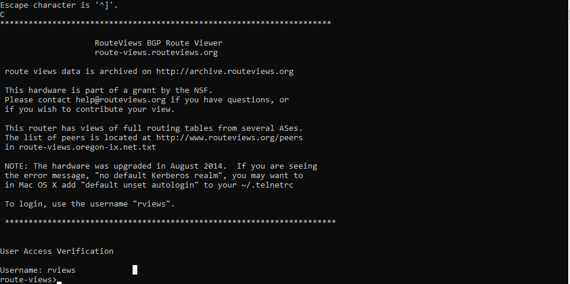
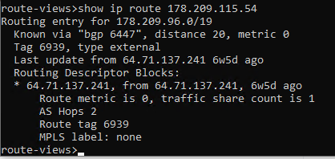
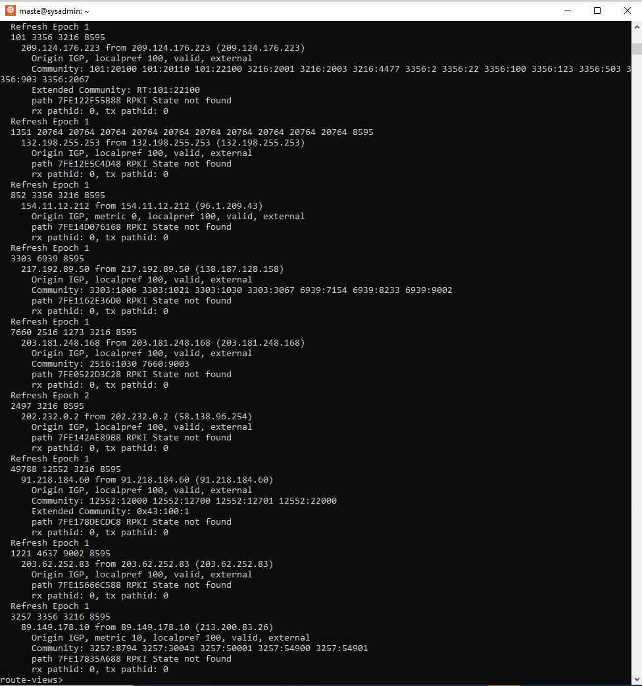
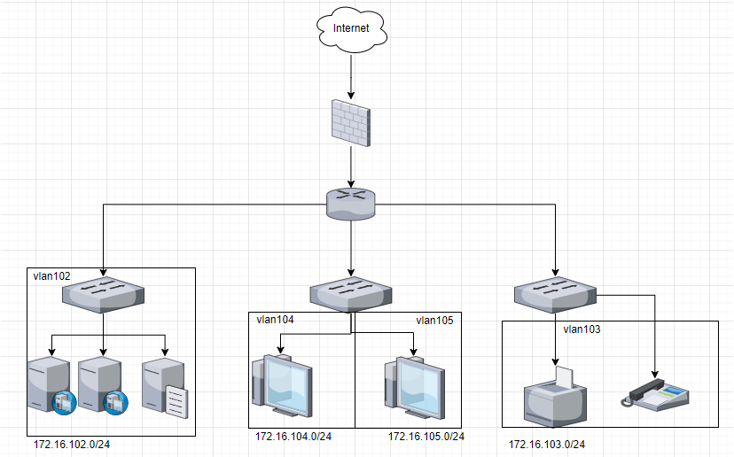

1) Подключитесь к публичному маршрутизатору в интернет. Найдите маршрут к вашему публичному IP
telnet route-views.routeviews.org
Username: rviews



show ip route x.x.x.x/32



show bgp x.x.x.x/32




2) Создайте dummy0 интерфейс в Ubuntu. Добавьте несколько статических маршрутов. Проверьте таблицу маршрутизации.

```bash
vagrant@vagrant:~$ ip a show type dummy
3: dummy0: <BROADCAST,NOARP,UP,LOWER_UP> mtu 1500 qdisc noqueue state UNKNOWN group default qlen 1000
    link/ether a2:27:5b:1e:b9:ea brd ff:ff:ff:ff:ff:ff
    inet 192.168.50.2/24 scope global dummy0
       valid_lft forever preferred_lft forever
    inet6 fe80::a027:5bff:fe1e:b9ea/64 scope link
       valid_lft forever preferred_lft forever
vagrant@vagrant:~$ sudo ip route add 192.168.30.0/24 via 10.0.1.1
vagrant@vagrant:~$ sudo ip route add 192.168.30.0/24 dev eth0
vagrant@vagrant:~$ ip -br route
default via 10.0.2.2 dev eth0 proto dhcp src 10.0.1.15 metric 100
10.0.2.0/24 dev eth0 proto kernel scope link src 10.0.1.15
10.0.2.2 dev eth0 proto dhcp scope link src 10.0.1.15 metric 100
192.168.30.0/24 via 10.0.1.1 dev eth0
192.168.40.0/24 dev eth0 scope link
192.168.50.0/24 dev dummy0 proto kernel scope link src 192.168.50.2
```
Проверьте открытые TCP порты в Ubuntu, какие протоколы и приложения используют эти порты? Приведите несколько примеров.

```
master@fortest:~$ sudo ss -ltpn
[sudo] password for master:
State        Recv-Q       Send-Q              Local Address:Port              Peer Address:Port       Process
LISTEN       0            4096                127.0.0.53%lo:53                     0.0.0.0:*           users:(("systemd-resolve",pid=793,fd=13))
LISTEN       0            128                       0.0.0.0:22                     0.0.0.0:*           users:(("sshd",pid=978,fd=3))
LISTEN       0            244                172.16.105.155:5432                   0.0.0.0:*           users:(("postgres",pid=1249,fd=5))
LISTEN       0            4096                    127.0.0.1:19001                  0.0.0.0:*           users:(("k8s-dqlite",pid=3728079,fd=15))
LISTEN       0            128                     127.0.0.1:6010                   0.0.0.0:*           users:(("sshd",pid=2964236,fd=11))
LISTEN       0            4096                    127.0.0.1:1338                   0.0.0.0:*           users:(("containerd",pid=2659021,fd=66))
LISTEN       0            4096                      0.0.0.0:32000                  0.0.0.0:*           users:(("kubelite",pid=2659280,fd=117))
LISTEN       0            4096                      0.0.0.0:31105                  0.0.0.0:*           users:(("kubelite",pid=2659280,fd=118))
LISTEN       0            4096                    127.0.0.1:44387                  0.0.0.0:*           users:(("containerd",pid=2659021,fd=108))
LISTEN       0            4096                    127.0.0.1:10248                  0.0.0.0:*           users:(("kubelite",pid=2659280,fd=143))
LISTEN       0            2048                      0.0.0.0:25000                  0.0.0.0:*           users:(("python3",pid=2659613,fd=5),("python3",pid=2659476,fd=5))
LISTEN       0            4096                    127.0.0.1:10249                  0.0.0.0:*           users:(("kubelite",pid=2659280,fd=127))
LISTEN       0            4096                    127.0.0.1:9099                   0.0.0.0:*           users:(("calico-node",pid=2662043,fd=7))
LISTEN       0            4096                    127.0.0.1:10256                  0.0.0.0:*           users:(("kubelite",pid=2659280,fd=126))
LISTEN       0            128                          [::]:22                        [::]:*           users:(("sshd",pid=978,fd=4))
LISTEN       0            128                         [::1]:6010                      [::]:*           users:(("sshd",pid=2964236,fd=10))
LISTEN       0            4096                            *:16443                        *:*           users:(("kubelite",pid=2659280,fd=7))
LISTEN       0            4096                            *:10250                        *:*           users:(("kubelite",pid=2659280,fd=149))
LISTEN       0            4096                            *:10255                        *:*           users:(("kubelite",pid=2659280,fd=148))
LISTEN       0            4096                            *:10257                        *:*           users:(("kubelite",pid=2659280,fd=120))
LISTEN       0            4096                            *:10259                        *:*           users:(("kubelite",pid=2659280,fd=119))
```


Проверьте используемые UDP сокеты в Ubuntu, какие протоколы и приложения используют эти порты?
```
master@fortest:~$ sudo ss -lupn
State          Recv-Q         Send-Q                         Local Address:Port                   Peer Address:Port         Process
UNCONN         0              0                              127.0.0.53%lo:53                          0.0.0.0:*             users:(("systemd-resolve",pid=793,fd=12))
UNCONN         0              0                        172.16.105.155%ens3:68                          0.0.0.0:*             users:(("systemd-network",pid=787,fd=15))
UNCONN         0              0                                    0.0.0.0:4789                        0.0.0.0:*
```


Используя diagrams.net, создайте L3 диаграмму вашей домашней сети или любой другой сети, с которой вы работали.

