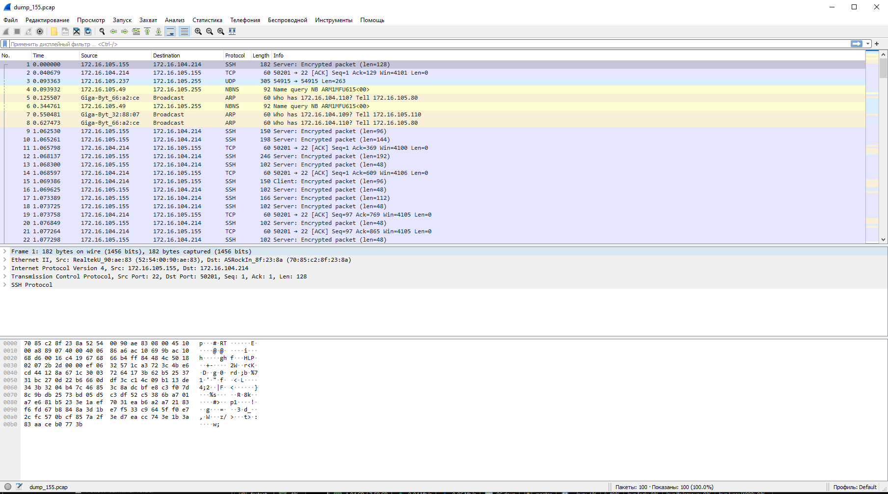

1) Установите Bitwarden плагин для браузера. Зарегестрируйтесь и сохраните несколько паролей.

-

2) Установите Google authenticator на мобильный телефон. Настройте вход в Bitwarden акаунт через Google authenticator OTP.

-

3) Установите apache2, сгенерируйте самоподписанный сертификат, настройте тестовый сайт для работы по HTTPS.

Установил apache2


Установил ssl mode и сгенерировать self-cert


Перешел на сайт по https


4) Проверьте на TLS уязвимости произвольный сайт в интернете (кроме сайтов МВД, ФСБ, МинОбр, НацБанк, РосКосмос, РосАтом, РосНАНО и любых госкомпаний, объектов КИИ, ВПК ... и тому подобное).

Скачал testssl с github
```
git clone --depth 1 https://github.com/drwetter/testssl.sh.git
```
Запустил скрипт с эндпоинтом guthub


5) Установите на Ubuntu ssh сервер, сгенерируйте новый приватный ключ. Скопируйте свой публичный ключ на другой сервер. Подключитесь к серверу по SSH-ключу.


6) Переименуйте файлы ключей из задания 5. Настройте файл конфигурации SSH клиента, так чтобы вход на удаленный сервер осуществлялся по имени сервера.

Переименовал файл 
```
mv /home/master/.ssh/id_rsa /home/master/.ssh/id_rsa_155
```


7) Соберите дамп трафика утилитой tcpdump в формате pcap, 100 пакетов. Откройте файл pcap в Wireshark.


