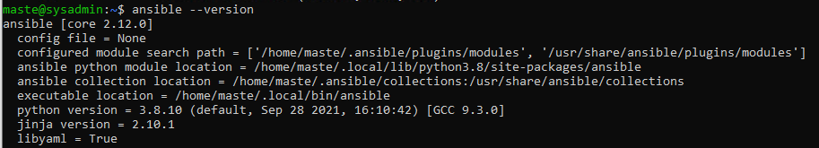

Домашнее задание к занятию "5.2. Применение принципов IaaC в работе с виртуальными машинами"

Задача 1

Опишите своими словами основные преимущества применения на практике IaaC паттернов.
Ответ:

Непрерывная интеграция позволяет быстро находить ошибки в коде за счет постоянного тестирования небольшими объемами. 
Непрерывная доставка также позволяет легко исправить или откатиться на недавнее состояние в случае ошибок.

Какой из принципов IaaC является основополагающим?
Ответ:

Получение стабильного и предсказуемого результата каждый раз при использовании(запуске) кода.

Задача 2

Чем Ansible выгодно отличается от других систем управление конфигурациями?

Его основные преимущества это использование SSH инфраструктуры без установки дополнительного окружения, а также наличие большого количества модулей.

Какой, на ваш взгляд, метод работы систем конфигурации более надёжный push или pull?

Метод push более надежный так как не требует установки доп ПО(демоны, агенты). Следовательно, надежнее. Pull требует установки
агентов а это потенциальная точка отказа.

Задача 3

Установить на личный компьютер:

VirtualBox

Vagrant

Ansible

Приложить вывод команд установленных версий каждой из программ, оформленный в markdown.

Задача 4 (*)
Воспроизвести практическую часть лекции самостоятельно.

Создать виртуальную машину.
Зайти внутрь ВМ, убедиться, что Docker установлен с помощью команды
docker ps