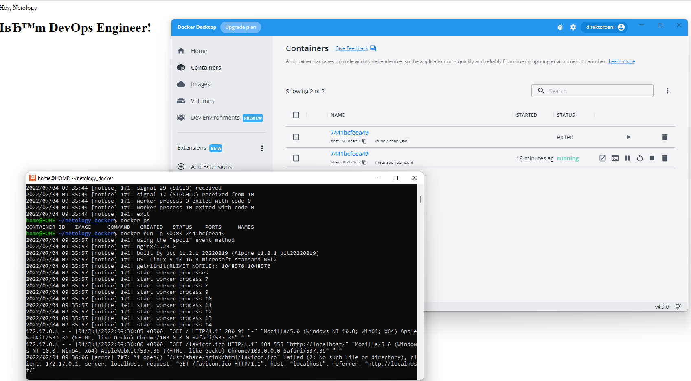
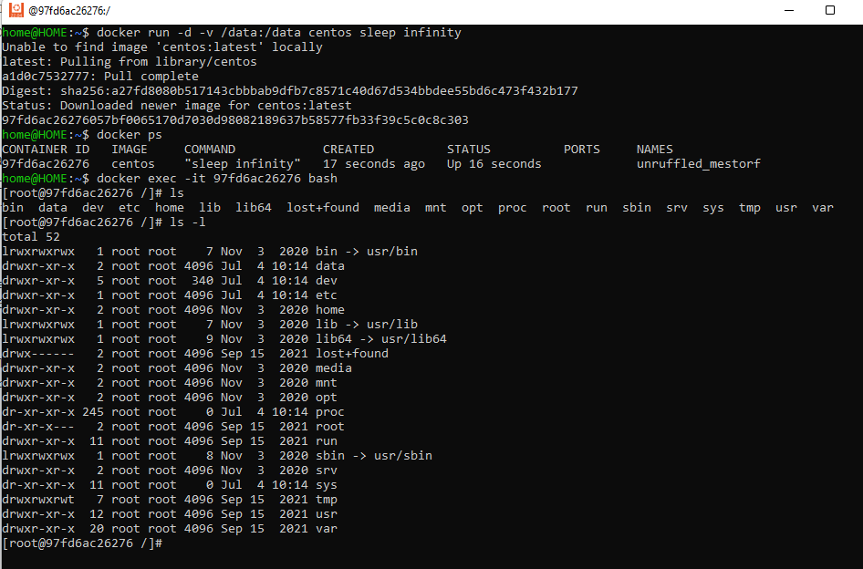
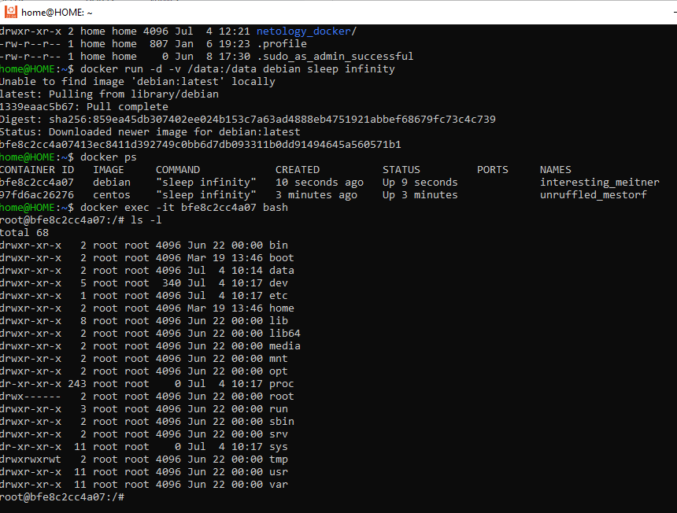
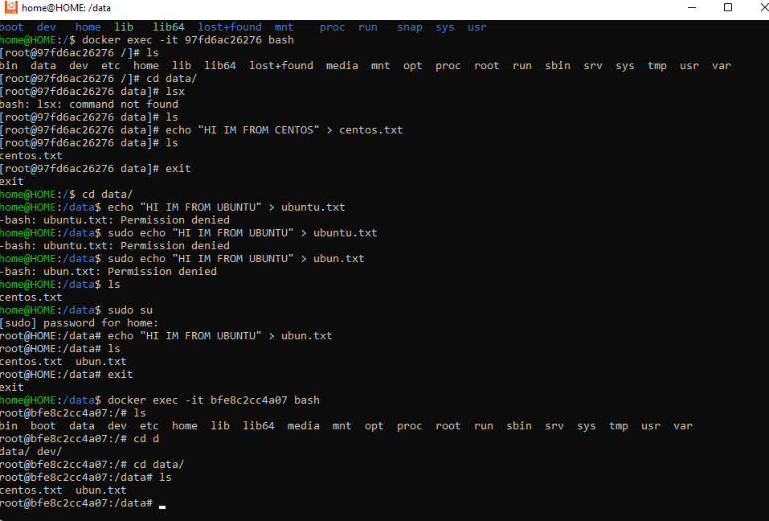

# Домашнее задание к занятию "5.3. Введение. Экосистема. Архитектура. Жизненный цикл Docker контейнера"


## Задача 1

Сценарий выполения задачи:

- создайте свой репозиторий на https://hub.docker.com;
- выберете любой образ, который содержит веб-сервер Nginx;
- создайте свой fork образа;
- реализуйте функциональность:
  запуск веб-сервера в фоне с индекс-страницей, содержащей HTML-код ниже:
```
<html>
<head>
Hey, Netology
</head>
<body>
<h1>I’m DevOps Engineer!</h1>
</body>
</html>
```
Опубликуйте созданный форк в своем репозитории и предоставьте ответ в виде ссылки на https://hub.docker.com/username_repo.

Ответ: https://hub.docker.com/repository/docker/direktorbani/netology_devops



## Задача 2

Посмотрите на сценарий ниже и ответьте на вопрос:
"Подходит ли в этом сценарии использование Docker контейнеров или лучше подойдет виртуальная машина, физическая машина? Может быть возможны разные варианты?"

Детально опишите и обоснуйте свой выбор.

--

Сценарий:

- Высоконагруженное монолитное java веб-приложение;
- Nodejs веб-приложение;
- Мобильное приложение c версиями для Android и iOS;
- Шина данных на базе Apache Kafka;
- Elasticsearch кластер для реализации логирования продуктивного веб-приложения - три ноды elasticsearch, два logstash и две ноды kibana;
- Мониторинг-стек на базе Prometheus и Grafana;
- MongoDB, как основное хранилище данных для java-приложения;
- Gitlab сервер для реализации CI/CD процессов и приватный (закрытый) Docker Registry.

- Высоконагруженное монолитное java веб-приложение - это приложение которое включает в себя все компоненты(frontend, backend, UI). Сома суть контейнеризации - это микросервисы которые объединяются в один сервис. Такое приложени стоит размещать непосредственно на физической среде для ускорения работы.
- Nodejs веб-приложение - такое приложение хорошо подходит для контейнеризации. Подходит под микросервисы и обычно не увесистои и быстрое
- Мобильное приложение c версиями для Android и iOS - мобильные приложения размещаются в соответствующих маркетах. Если речь о бекенде то бекенд преимущественно контейнеризируется и в ходит в состав кластера для этого приложения.
- Шина данных на базе Apache Kafka - По моему мнению хорошо применить контейнеризацию, так как отсутствуют накладные расходы на виртуализацию, достигается простота масштабирования и управления. В данном случае необходимо организация отказоустойчивости.
- Elasticsearch кластер для реализации логирования продуктивного веб-приложения - три ноды elasticsearch, два logstash и две ноды kibana - Сам происзводитель ELK стека логирования преимущественно рекомендует использовать контейнеры. В случае роста объема логирования и инфраструктуры легко масштабируются а так же есть композ файл для развертывания стека.
- Мониторинг-стек на базе Prometheus и Grafana - легковестный и более шустрый по сравнения с ЕЛК стек. Хорошо подходит для контейнеризации и дальнейшего масштабирования
- MongoDB, как основное хранилище данных для java-приложения - На мой взгляд преимущественно лучший выбор для развертывания баз данных - это физ машины и/или виртуализация для обеспечения большей отказоустойчивости.
- Gitlab сервер для реализации CI/CD процессов и приватный (закрытый) Docker Registry - однозначно физ машина. GitLab достаточно прожорлив и написан не на самом быстром языке. Виртуализация в большей части может не справиться с аппетитом гитлаба (если сервер виртуализации не топовый) а Docker Registry обычно ставят рядом с раннерами которые желательно выносить на отдельный сервер.

## Задача 3

- Запустите первый контейнер из образа ***centos*** c любым тэгом в фоновом режиме, подключив папку ```/data``` из текущей рабочей директории на хостовой машине в ```/data``` контейнера;

- Запустите второй контейнер из образа ***debian*** в фоновом режиме, подключив папку ```/data``` из текущей рабочей директории на хостовой машине в ```/data``` контейнера;

- Подключитесь к первому контейнеру с помощью ```docker exec``` и создайте текстовый файл любого содержания в ```/data```;
- Добавьте еще один файл в папку ```/data``` на хостовой машине;
- Подключитесь во второй контейнер и отобразите листинг и содержание файлов в ```/data``` контейнера.



## Задача 4 (*)

Воспроизвести практическую часть лекции самостоятельно.

Соберите Docker образ с Ansible, загрузите на Docker Hub и пришлите ссылку вместе с остальными ответами к задачам.


---

### Как cдавать задание

Выполненное домашнее задание пришлите ссылкой на .md-файл в вашем репозитории.

---
