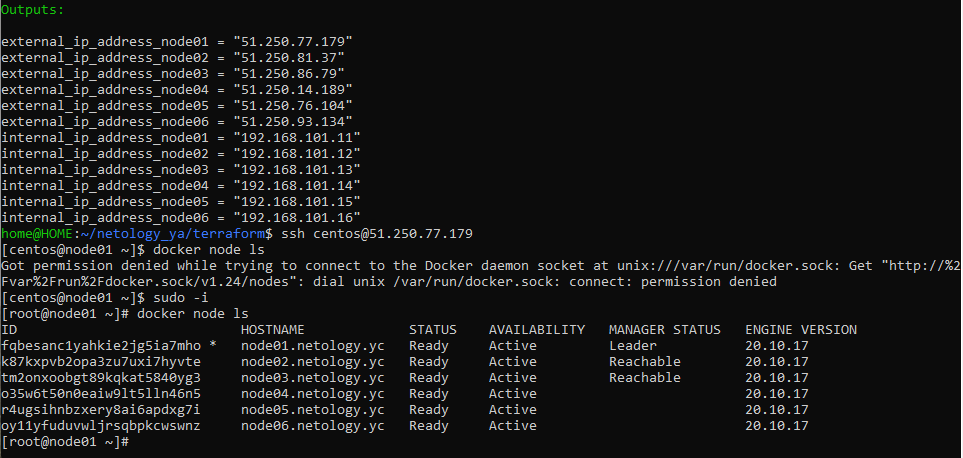
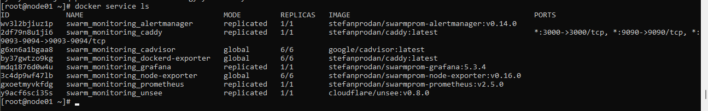

## Задача 1

Дайте письменые ответы на следующие вопросы:

- Отличие режимов работы сервисов Docker Swarm кластере заключается, в том, что в режиме global сервис запускается на всех нодах. Если используется режим replication, то указывается количество реплик используемых для сервиса.

- Для управления глобальным состоянием кластера используется протокол Raft в задачи, которые решаются данным протоколом так же входить выбор лидера.

- Используется для связи контейнеров расположенных на разных хостах. При построении используется уже существующая сеть и технология vxlan. Может быть включено шифрование IPSec.

## Задача 2

Создать ваш первый Docker Swarm кластер в Яндекс.Облаке

Для получения зачета, вам необходимо предоставить скриншот из терминала (консоли), с выводом команды:

## Задача 3

Создать ваш первый, готовый к боевой эксплуатации кластер мониторинга, состоящий из стека микросервисов.

Для получения зачета, вам необходимо предоставить скриншот из терминала (консоли), с выводом команды:

