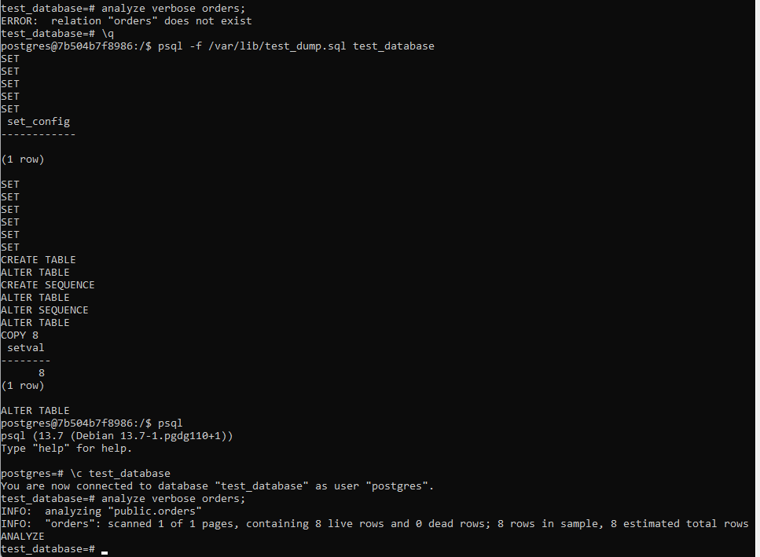
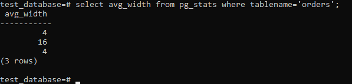
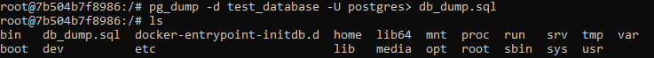

# Домашнее задание к занятию "6.4. PostgreSQL"

## Задача 1

Используя docker поднимите инстанс PostgreSQL (версию 13). Данные БД сохраните в volume.

Подключитесь к БД PostgreSQL используя `psql`.

Воспользуйтесь командой `\?` для вывода подсказки по имеющимся в `psql` управляющим командам.

**Найдите и приведите** управляющие команды для:
- вывода списка БД  - \l[+]   [PATTERN]      list databases
- подключения к БД  - \c[onnect] {[DBNAME|- USER|- HOST|- PORT|-] | conninfo}
- вывода списка таблиц  -  \dt[S+] [PATTERN]  list tables
- вывода описания содержимого таблиц  - \d[S+]  NAME  describe table, view, sequence, or index
- выхода из psql  - \q  quit psql

## Задача 2

Используя `psql` создайте БД `test_database`.

Изучите [бэкап БД](https://github.com/netology-code/virt-homeworks/tree/master/06-db-04-postgresql/test_data).

Восстановите бэкап БД в `test_database`.



Перейдите в управляющую консоль `psql` внутри контейнера.

Подключитесь к восстановленной БД и проведите операцию ANALYZE для сбора статистики по таблице.

Используя таблицу [pg_stats](https://postgrespro.ru/docs/postgresql/12/view-pg-stats), найдите столбец таблицы `orders`
с наибольшим средним значением размера элементов в байтах.

**Приведите в ответе** команду, которую вы использовали для вычисления и полученный результат.



## Задача 3

Архитектор и администратор БД выяснили, что ваша таблица orders разрослась до невиданных размеров и
поиск по ней занимает долгое время. Вам, как успешному выпускнику курсов DevOps в нетологии предложили
провести разбиение таблицы на 2 (шардировать на orders_1 - price>499 и orders_2 - price<=499).

Предложите SQL-транзакцию для проведения данной операции.

Можно ли было изначально исключить "ручное" разбиение при проектировании таблицы orders?

Да. Преобразовать существующую таблицу в партиционированную поэтому пересоздадим таблицу

```
alter table orders rename to orders_simple;
create table orders (id integer, title varchar(80), price integer) partition by range(price);
create table orders_less499 partition of orders for values from (0) to (499);
create table orders_more499 partition of orders for values from (499) to (999999999);
insert into orders (id, title, price) select * from orders_simple; 
```


## Задача 4

Используя утилиту `pg_dump` создайте бекап БД `test_database`.

Как бы вы доработали бэкап-файл, чтобы добавить уникальность значения столбца `title` для таблиц `test_database`?

Для определения занчения столбца title можно было бы использовать индекс, для обеспечения уникальности.



---

### Как cдавать задание

Выполненное домашнее задание пришлите ссылкой на .md-файл в вашем репозитории.

---
